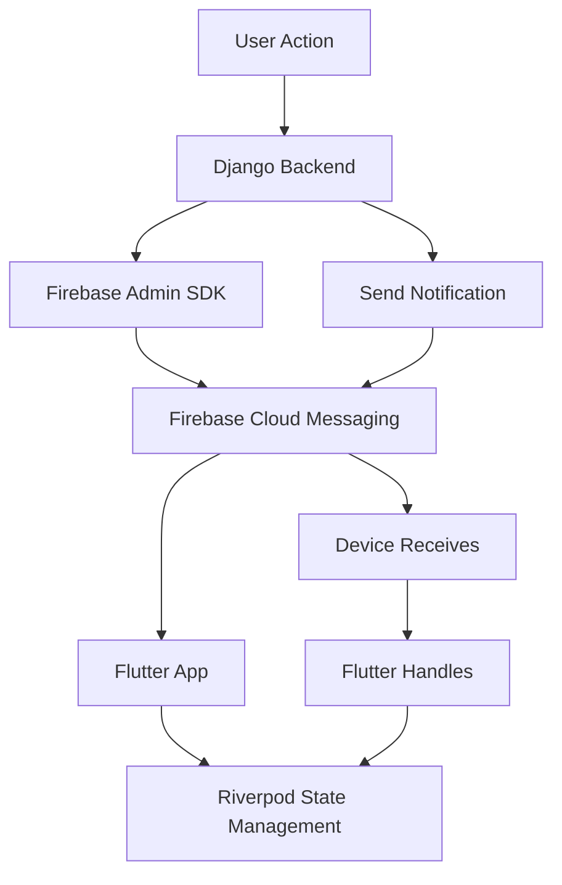

# 🔔 Guía Completa: Notificaciones Push con Django + Firebase + Flutter + Riverpod

## 📋 Tabla de Contenido

1. [Arquitectura del Sistema](#arquitectura-del-sistema)
2. [Configuración de Firebase](#configuración-de-firebase)
3. [Backend Django - Configuración](#backend-django-configuración)
4. [Backend Django - Implementación](#backend-django-implementación)
5. [Flutter - Configuración Inicial](#flutter-configuración-inicial)
6. [Flutter - Implementación con Riverpod](#flutter-implementación-con-riverpod)
7. [Integración Completa](#integración-completa)
8. [Testing y Debugging](#testing-y-debugging)
9. [Casos de Uso Avanzados](#casos-de-uso-avanzados)
10. [Troubleshooting](#troubleshooting)

---

## 🏗️ Arquitectura del Sistema



### Flujo de Notificaciones:
1. **Django Backend** → Envía notificación via Firebase Admin SDK
2. **Firebase FCM** → Entrega la notificación al dispositivo
3. **Flutter App** → Recibe y procesa la notificación
4. **Riverpod** → Maneja el estado y actualiza la UI

---

## 🔥 Configuración de Firebase

### Paso 1: Crear Proyecto Firebase

1. Ve a [Firebase Console](https://console.firebase.google.com/)
2. Crea un nuevo proyecto o selecciona uno existente
3. Habilita **Cloud Messaging**

### Paso 2: Configurar Firebase para Flutter

```bash
# Instalar Firebase CLI
npm install -g firebase-tools

# Login a Firebase
firebase login

# Instalar FlutterFire CLI
dart pub global activate flutterfire_cli

# Configurar Firebase en tu proyecto Flutter
flutterfire configure
```

### Paso 3: Obtener Credenciales del Servidor

1. En Firebase Console → **Project Settings** → **Service Accounts**
2. Clic en **Generate new private key**
3. Descarga el archivo JSON (ejemplo: `discorp-firebase-adminsdk.json`)
4. Guarda este archivo de forma segura

---

## ⚙️ Backend Django - Configuración

### Paso 1: Instalar Dependencias

```toml
# pyproject.toml
dependencies = [
    # ... tus dependencias existentes
    "firebase-admin>=6.2.0",
    "pyfcm>=1.5.4",  # Alternativa más simple
]
```

```bash
# Instalar dependencias
uv sync
```

### Paso 2: Configuración en Django Settings

```python
# core/settings.py

import firebase_admin
from firebase_admin import credentials
import os

# Firebase Configuration
FIREBASE_CONFIG = {
    'CREDENTIALS_PATH': os.path.join(BASE_DIR, 'firebase-credentials.json'),
    'PROJECT_ID': env.firebase_project_id,  # Agregar a tu environment.py
}

# Inicializar Firebase Admin SDK
if not firebase_admin._apps:
    cred = credentials.Certificate(FIREBASE_CONFIG['CREDENTIALS_PATH'])
    firebase_admin.initialize_app(cred, {
        'projectId': FIREBASE_CONFIG['PROJECT_ID'],
    })

# FCM Settings
FCM_DJANGO_SETTINGS = {
    "FCM_SERVER_KEY": env.fcm_server_key,  # Server Key de Firebase
    "ONE_DEVICE_REGISTRATION_ID_PER_USER": True,
    "DELETE_INACTIVE_TOKENS": True,
}
```

### Paso 3: Variables de Entorno

```python
# core/environment.py

class Environment:
    # ... tus variables existentes
    
    @property
    def firebase_project_id(self) -> str:
        return os.getenv("FIREBASE_PROJECT_ID", "discorp-app")
    
    @property
    def fcm_server_key(self) -> str:
        return os.getenv("FCM_SERVER_KEY", "")
```

```bash
# .env
FIREBASE_PROJECT_ID=tu-proyecto-firebase
FCM_SERVER_KEY=tu-server-key-de-firebase
```

---

## 🚀 Backend Django - Implementación

### Paso 1: Modelo para Tokens de Dispositivos

```python
# apps/notifications/models.py

from django.db import models
from django.contrib.auth import get_user_model

User = get_user_model()

class DeviceToken(models.Model):
    """Almacena tokens FCM de dispositivos de usuarios"""
    
    PLATFORM_CHOICES = [
        ('android', 'Android'),
        ('ios', 'iOS'),
        ('web', 'Web'),
    ]
    
    user = models.ForeignKey(
        User, 
        on_delete=models.CASCADE, 
        related_name='device_tokens',
        verbose_name="Usuario"
    )
    token = models.TextField(
        unique=True,
        verbose_name="Token FCM"
    )
    platform = models.CharField(
        max_length=10, 
        choices=PLATFORM_CHOICES,
        verbose_name="Plataforma"
    )
    is_active = models.BooleanField(
        default=True,
        verbose_name="Activo"
    )
    created_at = models.DateTimeField(auto_now_add=True)
    updated_at = models.DateTimeField(auto_now=True)
    
    class Meta:
        verbose_name = "Token de Dispositivo"
        verbose_name_plural = "Tokens de Dispositivos"
        unique_together = ('user', 'token')
    
    def __str__(self):
        return f"{self.user.username} - {self.platform} - {self.token[:20]}..."


class PushNotification(models.Model):
    """Historial de notificaciones enviadas"""
    
    STATUS_CHOICES = [
        ('pending', 'Pendiente'),
        ('sent', 'Enviada'),
        ('failed', 'Fallida'),
    ]
    
    user = models.ForeignKey(
        User,
        on_delete=models.CASCADE,
        related_name='push_notifications',
        verbose_name="Usuario"
    )
    title = models.CharField(max_length=255, verbose_name="Título")
    body = models.TextField(verbose_name="Mensaje")
    data = models.JSONField(
        default=dict,
        blank=True,
        verbose_name="Datos adicionales"
    )
    status = models.CharField(
        max_length=10,
        choices=STATUS_CHOICES,
        default='pending',
        verbose_name="Estado"
    )
    sent_at = models.DateTimeField(null=True, blank=True)
    error_message = models.TextField(blank=True, null=True)
    created_at = models.DateTimeField(auto_now_add=True)
    
    class Meta:
        verbose_name = "Notificación Push"
        verbose_name_plural = "Notificaciones Push"
        ordering = ['-created_at']
    
    def __str__(self):
        return f"{self.user.username} - {self.title}"
```

### Paso 2: Servicio de Notificaciones

```python
# apps/notifications/services.py

import firebase_admin
from firebase_admin import messaging
from typing import List, Dict, Optional
import logging
from django.utils import timezone
from .models import DeviceToken, PushNotification

logger = logging.getLogger(__name__)

class PushNotificationService:
    """Servicio para enviar notificaciones push usando Firebase FCM"""
    
    @staticmethod
    def send_to_user(
        user,
        title: str,
        body: str,
        data: Optional[Dict] = None,
        image_url: Optional[str] = None
    ) -> bool:
        """
        Envía notificación push a todos los dispositivos de un usuario
        
        Args:
            user: Usuario de Django
            title: Título de la notificación
            body: Cuerpo del mensaje
            data: Datos adicionales (opcional)
            image_url: URL de imagen (opcional)
            
        Returns:
            bool: True si se envió exitosamente
        """
        # Obtener tokens activos del usuario
        device_tokens = DeviceToken.objects.filter(
            user=user,
            is_active=True
        ).values_list('token', flat=True)
        
        if not device_tokens:
            logger.warning(f"No se encontraron tokens para el usuario {user.username}")
            return False
        
        # Crear registro de notificación
        notification_record = PushNotification.objects.create(
            user=user,
            title=title,
            body=body,
            data=data or {}
        )
        
        try:
            # Preparar mensaje FCM
            message = messaging.MulticastMessage(
                notification=messaging.Notification(
                    title=title,
                    body=body,
                    image=image_url
                ),
                data=data or {},
                tokens=list(device_tokens),
                android=messaging.AndroidConfig(
                    ttl=timezone.timedelta(hours=1),
                    priority='high',
                    notification=messaging.AndroidNotification(
                        icon='ic_notification',
                        color='#FF6B6B',
                        sound='default',
                        channel_id='discorp_notifications'
                    )
                ),
                apns=messaging.APNSConfig(
                    payload=messaging.APNSPayload(
                        aps=messaging.Aps(
                            alert=messaging.ApsAlert(
                                title=title,
                                body=body
                            ),
                            sound='default',
                            badge=1
                        )
                    )
                )
            )
            
            # Enviar notificación
            response = messaging.send_multicast(message)
            
            # Procesar respuesta
            if response.success_count > 0:
                notification_record.status = 'sent'
                notification_record.sent_at = timezone.now()
                logger.info(f"Notificación enviada a {response.success_count} dispositivos")
            else:
                notification_record.status = 'failed'
                notification_record.error_message = "No se pudo enviar a ningún dispositivo"
                logger.error("No se pudo enviar la notificación a ningún dispositivo")
            
            # Manejar tokens inválidos
            if response.failure_count > 0:
                PushNotificationService._handle_failed_tokens(
                    device_tokens, 
                    response.responses
                )
            
            notification_record.save()
            return response.success_count > 0
            
        except Exception as e:
            logger.error(f"Error enviando notificación: {str(e)}")
            notification_record.status = 'failed'
            notification_record.error_message = str(e)
            notification_record.save()
            return False
    
    @staticmethod
    def send_to_multiple_users(
        users: List,
        title: str,
        body: str,
        data: Optional[Dict] = None,
        image_url: Optional[str] = None
    ) -> Dict[str, bool]:
        """
        Envía notificaciones a múltiples usuarios
        
        Returns:
            Dict con el resultado por usuario
        """
        results = {}
        for user in users:
            results[user.username] = PushNotificationService.send_to_user(
                user, title, body, data, image_url
            )
        return results
    
    @staticmethod
    def send_to_all_users(
        title: str,
        body: str,
        data: Optional[Dict] = None,
        image_url: Optional[str] = None
    ) -> int:
        """
        Envía notificación a todos los usuarios con tokens activos
        
        Returns:
            Número de usuarios que recibieron la notificación
        """
        from django.contrib.auth import get_user_model
        User = get_user_model()
        
        # Obtener usuarios con tokens activos
        users_with_tokens = User.objects.filter(
            device_tokens__is_active=True
        ).distinct()
        
        success_count = 0
        for user in users_with_tokens:
            if PushNotificationService.send_to_user(user, title, body, data, image_url):
                success_count += 1
        
        return success_count
    
    @staticmethod
    def _handle_failed_tokens(tokens: List[str], responses: List):
        """Maneja tokens que fallaron, desactivándolos si es necesario"""
        for idx, response in enumerate(responses):
            if not response.success:
                token = tokens[idx]
                error_code = response.exception.code if response.exception else None
                
                # Desactivar tokens inválidos
                if error_code in ['invalid-registration-token', 'registration-token-not-registered']:
                    DeviceToken.objects.filter(token=token).update(is_active=False)
                    logger.info(f"Token desactivado: {token[:20]}...")


class NotificationTemplates:
    """Templates predefinidos para diferentes tipos de notificaciones"""
    
    @staticmethod
    def new_order(order_id: str, restaurant_name: str) -> Dict:
        return {
            'title': '🍕 ¡Nuevo Pedido!',
            'body': f'Tienes un nuevo pedido de {restaurant_name}',
            'data': {
                'type': 'new_order',
                'order_id': order_id,
                'action': 'open_order_details'
            }
        }
    
    @staticmethod
    def order_status_update(order_id: str, status: str) -> Dict:
        status_messages = {
            'confirmed': '✅ Tu pedido ha sido confirmado',
            'preparing': '👨‍🍳 Tu pedido está siendo preparado',
            'ready': '🎉 ¡Tu pedido está listo!',
            'delivered': '🚚 Tu pedido ha sido entregado'
        }
        
        return {
            'title': 'Actualización de Pedido',
            'body': status_messages.get(status, f'Estado del pedido: {status}'),
            'data': {
                'type': 'order_status',
                'order_id': order_id,
                'status': status,
                'action': 'open_order_details'
            }
        }
    
    @staticmethod
    def promotion(title: str, description: str, promo_code: str = None) -> Dict:
        return {
            'title': f'🎁 {title}',
            'body': description,
            'data': {
                'type': 'promotion',
                'promo_code': promo_code,
                'action': 'open_promotions'
            }
        }
```

### Paso 3: API Endpoints

```python
# apps/notifications/serializers.py

from rest_framework import serializers
from .models import DeviceToken, PushNotification

class DeviceTokenSerializer(serializers.ModelSerializer):
    class Meta:
        model = DeviceToken
        fields = ['token', 'platform']
        
    def create(self, validated_data):
        # Obtener usuario del contexto
        user = self.context['request'].user
        
        # Desactivar tokens anteriores del mismo usuario y plataforma
        DeviceToken.objects.filter(
            user=user,
            platform=validated_data['platform']
        ).update(is_active=False)
        
        # Crear nuevo token
        return DeviceToken.objects.create(
            user=user,
            **validated_data
        )

class SendNotificationSerializer(serializers.Serializer):
    user_id = serializers.IntegerField(required=False)
    title = serializers.CharField(max_length=255)
    body = serializers.CharField()
    data = serializers.JSONField(required=False, default=dict)
    image_url = serializers.URLField(required=False)
    send_to_all = serializers.BooleanField(default=False)

class PushNotificationSerializer(serializers.ModelSerializer):
    class Meta:
        model = PushNotification
        fields = '__all__'
        read_only_fields = ['user', 'status', 'sent_at', 'error_message']
```

```python
# apps/notifications/views.py

from rest_framework import viewsets, status
from rest_framework.decorators import action
from rest_framework.response import Response
from rest_framework.permissions import IsAuthenticated, IsAdminUser
from django.contrib.auth import get_user_model
from drf_yasg.utils import swagger_auto_schema
from drf_yasg import openapi

from .models import DeviceToken, PushNotification
from .serializers import (
    DeviceTokenSerializer, 
    SendNotificationSerializer,
    PushNotificationSerializer
)
from .services import PushNotificationService, NotificationTemplates

User = get_user_model()

class NotificationViewSet(viewsets.ModelViewSet):
    """ViewSet para manejar notificaciones push"""
    
    serializer_class = PushNotificationSerializer
    permission_classes = [IsAuthenticated]
    
    def get_queryset(self):
        if self.request.user.is_staff:
            return PushNotification.objects.all()
        return PushNotification.objects.filter(user=self.request.user)
    
    @swagger_auto_schema(
        method='post',
        operation_description="Registrar token FCM del dispositivo",
        request_body=DeviceTokenSerializer,
        responses={
            201: openapi.Response("Token registrado exitosamente"),
            400: openapi.Response("Datos inválidos")
        },
        tags=['Notificaciones']
    )
    @action(detail=False, methods=['post'])
    def register_device(self, request):
        """Registra o actualiza el token FCM del dispositivo del usuario"""
        serializer = DeviceTokenSerializer(
            data=request.data,
            context={'request': request}
        )
        
        if serializer.is_valid():
            serializer.save()
            return Response(
                {"message": "Token de dispositivo registrado exitosamente"},
                status=status.HTTP_201_CREATED
            )
        return Response(serializer.errors, status=status.HTTP_400_BAD_REQUEST)
    
    @swagger_auto_schema(
        method='post',
        operation_description="Enviar notificación push (solo admins)",
        request_body=SendNotificationSerializer,
        responses={
            200: openapi.Response("Notificación enviada exitosamente"),
            403: openapi.Response("Sin permisos"),
            400: openapi.Response("Datos inválidos")
        },
        tags=['Notificaciones']
    )
    @action(detail=False, methods=['post'], permission_classes=[IsAdminUser])
    def send_notification(self, request):
        """Envía notificación push a usuario específico o a todos"""
        serializer = SendNotificationSerializer(data=request.data)
        
        if serializer.is_valid():
            data = serializer.validated_data
            
            if data.get('send_to_all', False):
                # Enviar a todos los usuarios
                success_count = PushNotificationService.send_to_all_users(
                    title=data['title'],
                    body=data['body'],
                    data=data.get('data', {}),
                    image_url=data.get('image_url')
                )
                return Response({
                    "message": f"Notificación enviada a {success_count} usuarios"
                })
            
            elif data.get('user_id'):
                # Enviar a usuario específico
                try:
                    user = User.objects.get(id=data['user_id'])
                    success = PushNotificationService.send_to_user(
                        user=user,
                        title=data['title'],
                        body=data['body'],
                        data=data.get('data', {}),
                        image_url=data.get('image_url')
                    )
                    
                    if success:
                        return Response({"message": "Notificación enviada exitosamente"})
                    else:
                        return Response(
                            {"error": "No se pudo enviar la notificación"},
                            status=status.HTTP_400_BAD_REQUEST
                        )
                        
                except User.DoesNotExist:
                    return Response(
                        {"error": "Usuario no encontrado"},
                        status=status.HTTP_404_NOT_FOUND
                    )
            
            else:
                return Response(
                    {"error": "Debe especificar user_id o send_to_all"},
                    status=status.HTTP_400_BAD_REQUEST
                )
        
        return Response(serializer.errors, status=status.HTTP_400_BAD_REQUEST)
    
    @swagger_auto_schema(
        method='get',
        operation_description="Obtener templates de notificaciones disponibles",
        responses={200: openapi.Response("Lista de templates")},
        tags=['Notificaciones']
    )
    @action(detail=False, methods=['get'], permission_classes=[IsAdminUser])
    def templates(self, request):
        """Obtiene templates predefinidos para notificaciones"""
        return Response({
            "new_order": {
                "description": "Notificación de nuevo pedido",
                "parameters": ["order_id", "restaurant_name"]
            },
            "order_status": {
                "description": "Actualización de estado de pedido",
                "parameters": ["order_id", "status"],
                "status_options": ["confirmed", "preparing", "ready", "delivered"]
            },
            "promotion": {
                "description": "Notificación promocional",
                "parameters": ["title", "description", "promo_code (opcional)"]
            }
        })
    
    @swagger_auto_schema(
        method='post',
        operation_description="Enviar notificación usando template",
        request_body=openapi.Schema(
            type=openapi.TYPE_OBJECT,
            properties={
                'template': openapi.Schema(type=openapi.TYPE_STRING),
                'user_id': openapi.Schema(type=openapi.TYPE_INTEGER),
                'parameters': openapi.Schema(type=openapi.TYPE_OBJECT),
                'send_to_all': openapi.Schema(type=openapi.TYPE_BOOLEAN)
            }
        ),
        tags=['Notificaciones']
    )
    @action(detail=False, methods=['post'], permission_classes=[IsAdminUser])
    def send_template(self, request):
        """Envía notificación usando un template predefinido"""
        template_name = request.data.get('template')
        parameters = request.data.get('parameters', {})
        user_id = request.data.get('user_id')
        send_to_all = request.data.get('send_to_all', False)
        
        # Obtener template
        template_method = getattr(NotificationTemplates, template_name, None)
        if not template_method:
            return Response(
                {"error": "Template no encontrado"},
                status=status.HTTP_400_BAD_REQUEST
            )
        
        try:
            notification_data = template_method(**parameters)
            
            if send_to_all:
                success_count = PushNotificationService.send_to_all_users(**notification_data)
                return Response({
                    "message": f"Notificación template enviada a {success_count} usuarios"
                })
            elif user_id:
                user = User.objects.get(id=user_id)
                success = PushNotificationService.send_to_user(user, **notification_data)
                
                if success:
                    return Response({"message": "Notificación template enviada exitosamente"})
                else:
                    return Response(
                        {"error": "No se pudo enviar la notificación"},
                        status=status.HTTP_400_BAD_REQUEST
                    )
            else:
                return Response(
                    {"error": "Debe especificar user_id o send_to_all"},
                    status=status.HTTP_400_BAD_REQUEST
                )
                
        except Exception as e:
            return Response(
                {"error": f"Error procesando template: {str(e)}"},
                status=status.HTTP_400_BAD_REQUEST
            )
```

### Paso 4: URLs

```python
# apps/notifications/urls.py

from django.urls import path, include
from rest_framework.routers import DefaultRouter
from .views import NotificationViewSet

router = DefaultRouter()
router.register(r'notifications', NotificationViewSet, basename='notifications')

urlpatterns = [
    path('', include(router.urls)),
]
```

```python
# core/urls.py (agregar a urlpatterns)

urlpatterns = [
    # ... tus URLs existentes
    path('api/v1/', include('apps.notifications.urls')),
]
```

---

## 📱 Flutter - Configuración Inicial

### Paso 1: Dependencias Flutter

```yaml
# pubspec.yaml

dependencies:
  flutter:
    sdk: flutter
  
  # State Management
  flutter_riverpod: ^2.4.0
  riverpod_annotation: ^2.3.0
  
  # Firebase
  firebase_core: ^2.24.2
  firebase_messaging: ^14.7.10
  
  # Notifications
  flutter_local_notifications: ^16.3.0
  
  # HTTP
  dio: ^5.4.0
  
  # Storage
  shared_preferences: ^2.2.2
  
  # Permissions
  permission_handler: ^11.2.0
  
  # UI
  flutter_screenutil: ^5.9.0

dev_dependencies:
  flutter_test:
    sdk: flutter
  
  # Code Generation
  riverpod_generator: ^2.3.0
  build_runner: ^2.4.7
  json_annotation: ^4.8.1
  json_serializable: ^6.7.1
```

### Paso 2: Configuración Android

```xml
<!-- android/app/src/main/AndroidManifest.xml -->

<manifest xmlns:android="http://schemas.android.com/apk/res/android">
    
    <!-- Permisos para notificaciones -->
    <uses-permission android:name="android.permission.INTERNET" />
    <uses-permission android:name="android.permission.WAKE_LOCK" />
    <uses-permission android:name="android.permission.VIBRATE" />
    <uses-permission android:name="android.permission.RECEIVE_BOOT_COMPLETED" />
    <uses-permission android:name="android.permission.POST_NOTIFICATIONS"/>

    <application
        android:label="discorp"
        android:name="${applicationName}"
        android:icon="@mipmap/ic_launcher">
        
        <!-- ... tu configuración existente -->
        
        <!-- Firebase Messaging Service -->
        <service
            android:name=".MyFirebaseMessagingService"
            android:exported="false">
            <intent-filter>
                <action android:name="com.google.firebase.MESSAGING_EVENT" />
            </intent-filter>
        </service>
        
        <!-- Notification Channel -->
        <meta-data
            android:name="com.google.firebase.messaging.default_notification_channel_id"
            android:value="discorp_notifications" />
            
        <!-- Notification Icon -->
        <meta-data
            android:name="com.google.firebase.messaging.default_notification_icon"
            android:resource="@drawable/ic_notification" />
            
        <!-- Notification Color -->
        <meta-data
            android:name="com.google.firebase.messaging.default_notification_color"
            android:resource="@color/notification_color" />
            
    </application>
</manifest>
```

### Paso 3: Configuración iOS

```xml
<!-- ios/Runner/Info.plist -->

<?xml version="1.0" encoding="UTF-8"?>
<!DOCTYPE plist PUBLIC "-//Apple//DTD PLIST 1.0//EN" "http://www.apple.com/DTDs/PropertyList-1.0.dtd">
<plist version="1.0">
<dict>
    <!-- ... tu configuración existente -->
    
    <!-- Firebase Configuration -->
    <key>FirebaseAppDelegateProxyEnabled</key>
    <false/>
    
    <!-- Background Modes -->
    <key>UIBackgroundModes</key>
    <array>
        <string>fetch</string>
        <string>remote-notification</string>
    </array>
    
</dict>
</plist>
```

---

## 🔧 Flutter - Implementación con Riverpod

### Paso 1: Modelos de Datos

```dart
// lib/models/notification_models.dart

import 'package:json_annotation/json_annotation.dart';

part 'notification_models.g.dart';

@JsonSerializable()
class PushNotificationData {
  final String type;
  final String? orderId;
  final String? status;
  final String? promoCode;
  final String action;
  
  PushNotificationData({
    required this.type,
    this.orderId,
    this.status,
    this.promoCode,
    required this.action,
  });
  
  factory PushNotificationData.fromJson(Map<String, dynamic> json) =>
      _$PushNotificationDataFromJson(json);
  
  Map<String, dynamic> toJson() => _$PushNotificationDataToJson(this);
}

@JsonSerializable()
class NotificationMessage {
  final String id;
  final String title;
  final String body;
  final PushNotificationData? data;
  final DateTime receivedAt;
  final bool isRead;
  
  NotificationMessage({
    required this.id,
    required this.title,
    required this.body,
    this.data,
    required this.receivedAt,
    this.isRead = false,
  });
  
  factory NotificationMessage.fromJson(Map<String, dynamic> json) =>
      _$NotificationMessageFromJson(json);
  
  Map<String, dynamic> toJson() => _$NotificationMessageToJson(this);
  
  NotificationMessage copyWith({
    String? id,
    String? title,
    String? body,
    PushNotificationData? data,
    DateTime? receivedAt,
    bool? isRead,
  }) {
    return NotificationMessage(
      id: id ?? this.id,
      title: title ?? this.title,
      body: body ?? this.body,
      data: data ?? this.data,
      receivedAt: receivedAt ?? this.receivedAt,
      isRead: isRead ?? this.isRead,
    );
  }
}

enum NotificationType {
  newOrder,
  orderStatus,
  promotion,
  general,
}

extension NotificationTypeExtension on NotificationType {
  String get value {
    switch (this) {
      case NotificationType.newOrder:
        return 'new_order';
      case NotificationType.orderStatus:
        return 'order_status';
      case NotificationType.promotion:
        return 'promotion';
      case NotificationType.general:
        return 'general';
    }
  }
  
  static NotificationType fromString(String value) {
    switch (value) {
      case 'new_order':
        return NotificationType.newOrder;
      case 'order_status':
        return NotificationType.orderStatus;
      case 'promotion':
        return NotificationType.promotion;
      default:
        return NotificationType.general;
    }
  }
}
```

### Paso 2: Servicio de Firebase

```dart
// lib/services/firebase_service.dart

import 'package:firebase_core/firebase_core.dart';
import 'package:firebase_messaging/firebase_messaging.dart';
import 'package:flutter_local_notifications/flutter_local_notifications.dart';
import 'package:permission_handler/permission_handler.dart';
import '../models/notification_models.dart';
import 'dart:convert';

class FirebaseService {
  static final FirebaseService _instance = FirebaseService._internal();
  factory FirebaseService() => _instance;
  FirebaseService._internal();

  FirebaseMessaging? _messaging;
  FlutterLocalNotificationsPlugin? _localNotifications;
  
  // Callbacks
  Function(NotificationMessage)? onMessageReceived;
  Function(NotificationMessage)? onMessageOpenedApp;
  
  Future<void> initialize() async {
    await Firebase.initializeApp();
    _messaging = FirebaseMessaging.instance;
    
    await _setupLocalNotifications();
    await _requestPermissions();
    await _setupMessageHandlers();
  }
  
  Future<void> _setupLocalNotifications() async {
    _localNotifications = FlutterLocalNotificationsPlugin();
    
    const androidSettings = AndroidInitializationSettings('@mipmap/ic_launcher');
    const iosSettings = DarwinInitializationSettings(
      requestAlertPermission: true,
      requestBadgePermission: true,
      requestSoundPermission: true,
    );
    
    const initSettings = InitializationSettings(
      android: androidSettings,
      iOS: iosSettings,
    );
    
    await _localNotifications!.initialize(
      initSettings,
      onDidReceiveNotificationResponse: _onNotificationTapped,
    );
    
    // Crear canal de notificaciones para Android
    const androidChannel = AndroidNotificationChannel(
      'discorp_notifications',
      'Discorp Notifications',
      description: 'Notificaciones de la app Discorp',
      importance: Importance.high,
      playSound: true,
    );
    
    await _localNotifications!
        .resolvePlatformSpecificImplementation<
            AndroidFlutterLocalNotificationsPlugin>()
        ?.createNotificationChannel(androidChannel);
  }
  
  Future<void> _requestPermissions() async {
    // Permisos de Firebase
    NotificationSettings settings = await _messaging!.requestPermission(
      alert: true,
      announcement: false,
      badge: true,
      carPlay: false,
      criticalAlert: false,
      provisional: false,
      sound: true,
    );
    
    print('Permission status: ${settings.authorizationStatus}');
    
    // Permisos adicionales para Android 13+
    if (await Permission.notification.isDenied) {
      await Permission.notification.request();
    }
  }
  
  Future<void> _setupMessageHandlers() async {
    // Mensaje recibido cuando la app está en foreground
    FirebaseMessaging.onMessage.listen(_handleForegroundMessage);
    
    // Mensaje que abrió la app (desde terminated state)
    FirebaseMessaging.onMessageOpenedApp.listen(_handleMessageOpenedApp);
    
    // Verificar si la app fue abierta desde una notificación
    RemoteMessage? initialMessage = await _messaging!.getInitialMessage();
    if (initialMessage != null) {
      _handleMessageOpenedApp(initialMessage);
    }
    
    // Background message handler
    FirebaseMessaging.onBackgroundMessage(_firebaseMessagingBackgroundHandler);
  }
  
  Future<void> _handleForegroundMessage(RemoteMessage message) async {
    print('Mensaje recibido en foreground: ${message.messageId}');
    
    final notificationMessage = _createNotificationMessage(message);
    
    // Mostrar notificación local
    await _showLocalNotification(message);
    
    // Callback para actualizar UI
    onMessageReceived?.call(notificationMessage);
  }
  
  Future<void> _handleMessageOpenedApp(RemoteMessage message) async {
    print('App abierta desde notificación: ${message.messageId}');
    
    final notificationMessage = _createNotificationMessage(message);
    
    // Callback para navegación
    onMessageOpenedApp?.call(notificationMessage);
  }
  
  Future<void> _showLocalNotification(RemoteMessage message) async {
    const androidDetails = AndroidNotificationDetails(
      'discorp_notifications',
      'Discorp Notifications',
      channelDescription: 'Notificaciones de la app Discorp',
      importance: Importance.high,
      priority: Priority.high,
      showWhen: true,
      icon: '@drawable/ic_notification',
      color: Color(0xFFFF6B6B),
      playSound: true,
      enableVibration: true,
    );
    
    const iosDetails = DarwinNotificationDetails(
      presentAlert: true,
      presentBadge: true,
      presentSound: true,
    );
    
    const details = NotificationDetails(
      android: androidDetails,
      iOS: iosDetails,
    );
    
    await _localNotifications!.show(
      message.hashCode,
      message.notification?.title ?? 'Discorp',
      message.notification?.body ?? '',
      details,
      payload: jsonEncode(message.data),
    );
  }
  
  void _onNotificationTapped(NotificationResponse response) {
    if (response.payload != null) {
      try {
        final data = jsonDecode(response.payload!);
        final message = RemoteMessage(data: Map<String, String>.from(data));
        final notificationMessage = _createNotificationMessage(message);
        onMessageOpenedApp?.call(notificationMessage);
      } catch (e) {
        print('Error procesando payload de notificación: $e');
      }
    }
  }
  
  NotificationMessage _createNotificationMessage(RemoteMessage message) {
    PushNotificationData? notificationData;
    
    if (message.data.isNotEmpty) {
      try {
        notificationData = PushNotificationData.fromJson(
          Map<String, dynamic>.from(message.data)
        );
      } catch (e) {
        print('Error parsing notification data: $e');
      }
    }
    
    return NotificationMessage(
      id: message.messageId ?? DateTime.now().millisecondsSinceEpoch.toString(),
      title: message.notification?.title ?? 'Discorp',
      body: message.notification?.body ?? '',
      data: notificationData,
      receivedAt: DateTime.now(),
    );
  }
  
  Future<String?> getToken() async {
    try {
      String? token = await _messaging!.getToken();
      print('FCM Token: $token');
      return token;
    } catch (e) {
      print('Error obteniendo FCM token: $e');
      return null;
    }
  }
  
  Future<void> subscribeToTopic(String topic) async {
    await _messaging!.subscribeToTopic(topic);
    print('Suscrito al topic: $topic');
  }
  
  Future<void> unsubscribeFromTopic(String topic) async {
    await _messaging!.unsubscribeFromTopic(topic);
    print('Desuscrito del topic: $topic');
  }
}

// Background message handler (debe estar en top-level)
@pragma('vm:entry-point')
Future<void> _firebaseMessagingBackgroundHandler(RemoteMessage message) async {
  await Firebase.initializeApp();
  print('Background message: ${message.messageId}');
}
```

### Paso 3: Providers con Riverpod

```dart
// lib/providers/notification_providers.dart

import 'package:riverpod_annotation/riverpod_annotation.dart';
import 'package:shared_preferences/shared_preferences.dart';
import '../models/notification_models.dart';
import '../services/firebase_service.dart';
import '../services/api_service.dart';
import 'dart:convert';

part 'notification_providers.g.dart';

@Riverpod(keepAlive: true)
class NotificationState extends _$NotificationState {
  static const String _notificationsKey = 'stored_notifications';
  
  @override
  List<NotificationMessage> build() {
    _loadStoredNotifications();
    return [];
  }
  
  Future<void> _loadStoredNotifications() async {
    try {
      final prefs = await SharedPreferences.getInstance();
      final notificationsJson = prefs.getStringList(_notificationsKey) ?? [];
      
      final notifications = notificationsJson
          .map((json) => NotificationMessage.fromJson(jsonDecode(json)))
          .toList();
      
      // Ordenar por fecha (más recientes primero)
      notifications.sort((a, b) => b.receivedAt.compareTo(a.receivedAt));
      
      state = notifications;
    } catch (e) {
      print('Error cargando notificaciones: $e');
    }
  }
  
  Future<void> _saveNotifications() async {
    try {
      final prefs = await SharedPreferences.getInstance();
      final notificationsJson = state
          .map((notification) => jsonEncode(notification.toJson()))
          .toList();
      
      await prefs.setStringList(_notificationsKey, notificationsJson);
    } catch (e) {
      print('Error guardando notificaciones: $e');
    }
  }
  
  void addNotification(NotificationMessage notification) {
    state = [notification, ...state];
    _saveNotifications();
  }
  
  void markAsRead(String notificationId) {
    state = state.map((notification) {
      if (notification.id == notificationId) {
        return notification.copyWith(isRead: true);
      }
      return notification;
    }).toList();
    _saveNotifications();
  }
  
  void markAllAsRead() {
    state = state.map((notification) => notification.copyWith(isRead: true)).toList();
    _saveNotifications();
  }
  
  void removeNotification(String notificationId) {
    state = state.where((notification) => notification.id != notificationId).toList();
    _saveNotifications();
  }
  
  void clearAll() {
    state = [];
    _saveNotifications();
  }
  
  int get unreadCount => state.where((notification) => !notification.isRead).length;
  
  List<NotificationMessage> get unreadNotifications => 
      state.where((notification) => !notification.isRead).toList();
}

@Riverpod(keepAlive: true)
class FirebaseManager extends _$FirebaseManager {
  @override
  bool build() {
    _initializeFirebase();
    return false;
  }
  
  Future<void> _initializeFirebase() async {
    try {
      final firebaseService = FirebaseService();
      await firebaseService.initialize();
      
      // Configurar callbacks
      firebaseService.onMessageReceived = (notification) {
        ref.read(notificationStateProvider.notifier).addNotification(notification);
      };
      
      firebaseService.onMessageOpenedApp = (notification) {
        ref.read(notificationStateProvider.notifier).markAsRead(notification.id);
        _handleNotificationAction(notification);
      };
      
      state = true;
    } catch (e) {
      print('Error inicializando Firebase: $e');
      state = false;
    }
  }
  
  void _handleNotificationAction(NotificationMessage notification) {
    if (notification.data == null) return;
    
    final action = notification.data!.action;
    
    switch (action) {
      case 'open_order_details':
        if (notification.data!.orderId != null) {
          // Navegar a detalles del pedido
          // NavigationService.navigateToOrderDetails(notification.data!.orderId!);
        }
        break;
      case 'open_promotions':
        // Navegar a promociones
        // NavigationService.navigateToPromotions();
        break;
      default:
        // Acción por defecto
        break;
    }
  }
  
  Future<String?> getDeviceToken() async {
    if (!state) return null;
    return await FirebaseService().getToken();
  }
  
  Future<void> subscribeToTopic(String topic) async {
    if (!state) return;
    await FirebaseService().subscribeToTopic(topic);
  }
  
  Future<void> unsubscribeFromTopic(String topic) async {
    if (!state) return;
    await FirebaseService().unsubscribeFromTopic(topic);
  }
}

@riverpod
Future<bool> registerDeviceToken(RegisterDeviceTokenRef ref, String platform) async {
  try {
    final token = await ref.read(firebaseManagerProvider.notifier).getDeviceToken();
    if (token == null) return false;
    
    final apiService = ref.read(apiServiceProvider);
    final success = await apiService.registerDeviceToken(token, platform);
    
    if (success) {
      print('Token registrado exitosamente en el servidor');
    }
    
    return success;
  } catch (e) {
    print('Error registrando token: $e');
    return false;
  }
}
```

### Paso 4: Servicio API

```dart
// lib/services/api_service.dart

import 'package:dio/dio.dart';
import 'package:riverpod_annotation/riverpod_annotation.dart';

part 'api_service.g.dart';

class ApiService {
  late final Dio _dio;
  
  ApiService({String? baseUrl}) {
    _dio = Dio(BaseOptions(
      baseUrl: baseUrl ?? 'https://backend-discrop-production.up.railway.app/api/v1',
      connectTimeout: const Duration(seconds: 30),
      receiveTimeout: const Duration(seconds: 30),
      headers: {
        'Content-Type': 'application/json',
      },
    ));
    
    _dio.interceptors.add(LogInterceptor(
      requestBody: true,
      responseBody: true,
    ));
  }
  
  void setAuthToken(String token) {
    _dio.options.headers['Authorization'] = 'Bearer $token';
  }
  
  Future<bool> registerDeviceToken(String token, String platform) async {
    try {
      final response = await _dio.post(
        '/notifications/register_device/',
        data: {
          'token': token,
          'platform': platform,
        },
      );
      
      return response.statusCode == 201;
    } catch (e) {
      print('Error registrando device token: $e');
      return false;
    }
  }
  
  Future<List<Map<String, dynamic>>> getNotificationHistory() async {
    try {
      final response = await _dio.get('/notifications/');
      return List<Map<String, dynamic>>.from(response.data);
    } catch (e) {
      print('Error obteniendo historial de notificaciones: $e');
      return [];
    }
  }
}

@Riverpod(keepAlive: true)
ApiService apiService(ApiServiceRef ref) {
  return ApiService();
}
```

### Paso 5: UI Components

```dart
// lib/widgets/notification_badge.dart

import 'package:flutter/material.dart';
import 'package:flutter_riverpod/flutter_riverpod.dart';
import '../providers/notification_providers.dart';

class NotificationBadge extends ConsumerWidget {
  final Widget child;
  final Color? badgeColor;
  
  const NotificationBadge({
    Key? key,
    required this.child,
    this.badgeColor,
  }) : super(key: key);
  
  @override
  Widget build(BuildContext context, WidgetRef ref) {
    final unreadCount = ref.watch(
      notificationStateProvider.select((notifications) => 
        notifications.where((n) => !n.isRead).length)
    );
    
    return Stack(
      children: [
        child,
        if (unreadCount > 0)
          Positioned(
            right: 0,
            top: 0,
            child: Container(
              padding: const EdgeInsets.all(2),
              decoration: BoxDecoration(
                color: badgeColor ?? Colors.red,
                borderRadius: BorderRadius.circular(10),
              ),
              constraints: const BoxConstraints(
                minWidth: 16,
                minHeight: 16,
              ),
              child: Text(
                unreadCount > 99 ? '99+' : unreadCount.toString(),
                style: const TextStyle(
                  color: Colors.white,
                  fontSize: 12,
                  fontWeight: FontWeight.bold,
                ),
                textAlign: TextAlign.center,
              ),
            ),
          ),
      ],
    );
  }
}
```

```dart
// lib/screens/notifications_screen.dart

import 'package:flutter/material.dart';
import 'package:flutter_riverpod/flutter_riverpod.dart';
import '../providers/notification_providers.dart';
import '../models/notification_models.dart';

class NotificationsScreen extends ConsumerWidget {
  const NotificationsScreen({Key? key}) : super(key: key);
  
  @override
  Widget build(BuildContext context, WidgetRef ref) {
    final notifications = ref.watch(notificationStateProvider);
    
    return Scaffold(
      appBar: AppBar(
        title: const Text('Notificaciones'),
        actions: [
          if (notifications.isNotEmpty)
            PopupMenuButton<String>(
              onSelected: (value) {
                switch (value) {
                  case 'mark_all_read':
                    ref.read(notificationStateProvider.notifier).markAllAsRead();
                    break;
                  case 'clear_all':
                    _showClearAllDialog(context, ref);
                    break;
                }
              },
              itemBuilder: (context) => [
                const PopupMenuItem(
                  value: 'mark_all_read',
                  child: Text('Marcar todas como leídas'),
                ),
                const PopupMenuItem(
                  value: 'clear_all',
                  child: Text('Eliminar todas'),
                ),
              ],
            ),
        ],
      ),
      body: notifications.isEmpty
          ? const _EmptyNotifications()
          : ListView.separated(
              itemCount: notifications.length,
              separatorBuilder: (context, index) => const Divider(height: 1),
              itemBuilder: (context, index) {
                final notification = notifications[index];
                return _NotificationTile(
                  notification: notification,
                  onTap: () => _handleNotificationTap(context, ref, notification),
                  onDismiss: () => ref
                      .read(notificationStateProvider.notifier)
                      .removeNotification(notification.id),
                );
              },
            ),
    );
  }
  
  void _handleNotificationTap(BuildContext context, WidgetRef ref, NotificationMessage notification) {
    // Marcar como leída
    if (!notification.isRead) {
      ref.read(notificationStateProvider.notifier).markAsRead(notification.id);
    }
    
    // Manejar acción según el tipo
    if (notification.data != null) {
      switch (notification.data!.action) {
        case 'open_order_details':
          if (notification.data!.orderId != null) {
            // Navigator.pushNamed(context, '/order-details', arguments: notification.data!.orderId);
          }
          break;
        case 'open_promotions':
          // Navigator.pushNamed(context, '/promotions');
          break;
      }
    }
  }
  
  void _showClearAllDialog(BuildContext context, WidgetRef ref) {
    showDialog(
      context: context,
      builder: (context) => AlertDialog(
        title: const Text('Eliminar todas las notificaciones'),
        content: const Text('¿Estás seguro de que quieres eliminar todas las notificaciones?'),
        actions: [
          TextButton(
            onPressed: () => Navigator.pop(context),
            child: const Text('Cancelar'),
          ),
          TextButton(
            onPressed: () {
              ref.read(notificationStateProvider.notifier).clearAll();
              Navigator.pop(context);
            },
            child: const Text('Eliminar'),
          ),
        ],
      ),
    );
  }
}

class _NotificationTile extends StatelessWidget {
  final NotificationMessage notification;
  final VoidCallback onTap;
  final VoidCallback onDismiss;
  
  const _NotificationTile({
    required this.notification,
    required this.onTap,
    required this.onDismiss,
  });
  
  @override
  Widget build(BuildContext context) {
    return Dismissible(
      key: Key(notification.id),
      direction: DismissDirection.endToStart,
      onDismissed: (_) => onDismiss(),
      background: Container(
        alignment: Alignment.centerRight,
        padding: const EdgeInsets.only(right: 16),
        color: Colors.red,
        child: const Icon(Icons.delete, color: Colors.white),
      ),
      child: ListTile(
        leading: CircleAvatar(
          backgroundColor: notification.isRead 
              ? Colors.grey.shade300 
              : Theme.of(context).primaryColor,
          child: Icon(
            _getNotificationIcon(notification.data?.type),
            color: notification.isRead ? Colors.grey : Colors.white,
          ),
        ),
        title: Text(
          notification.title,
          style: TextStyle(
            fontWeight: notification.isRead ? FontWeight.normal : FontWeight.bold,
          ),
        ),
        subtitle: Column(
          crossAxisAlignment: CrossAxisAlignment.start,
          children: [
            Text(notification.body),
            const SizedBox(height: 4),
            Text(
              _formatDateTime(notification.receivedAt),
              style: Theme.of(context).textTheme.bodySmall,
            ),
          ],
        ),
        isThreeLine: true,
        onTap: onTap,
        trailing: notification.isRead 
            ? null 
            : Container(
                width: 8,
                height: 8,
                decoration: BoxDecoration(
                  color: Theme.of(context).primaryColor,
                  shape: BoxShape.circle,
                ),
              ),
      ),
    );
  }
  
  IconData _getNotificationIcon(String? type) {
    switch (type) {
      case 'new_order':
        return Icons.shopping_bag;
      case 'order_status':
        return Icons.info;
      case 'promotion':
        return Icons.local_offer;
      default:
        return Icons.notifications;
    }
  }
  
  String _formatDateTime(DateTime dateTime) {
    final now = DateTime.now();
    final difference = now.difference(dateTime);
    
    if (difference.inMinutes < 1) {
      return 'Ahora';
    } else if (difference.inHours < 1) {
      return '${difference.inMinutes}m';
    } else if (difference.inDays < 1) {
      return '${difference.inHours}h';
    } else if (difference.inDays < 7) {
      return '${difference.inDays}d';
    } else {
      return '${dateTime.day}/${dateTime.month}';
    }
  }
}

class _EmptyNotifications extends StatelessWidget {
  const _EmptyNotifications();
  
  @override
  Widget build(BuildContext context) {
    return Center(
      child: Column(
        mainAxisAlignment: MainAxisAlignment.center,
        children: [
          Icon(
            Icons.notifications_none,
            size: 64,
            color: Colors.grey.shade400,
          ),
          const SizedBox(height: 16),
          Text(
            'No tienes notificaciones',
            style: Theme.of(context).textTheme.titleLarge?.copyWith(
              color: Colors.grey.shade600,
            ),
          ),
          const SizedBox(height: 8),
          Text(
            'Las notificaciones aparecerán aquí cuando las recibas',
            style: Theme.of(context).textTheme.bodyMedium?.copyWith(
              color: Colors.grey.shade500,
            ),
            textAlign: TextAlign.center,
          ),
        ],
      ),
    );
  }
}
```

### Paso 6: Inicialización en main.dart

```dart
// lib/main.dart

import 'package:flutter/material.dart';
import 'package:flutter_riverpod/flutter_riverpod.dart';
import 'package:flutter_screenutil/flutter_screenutil.dart';
import 'providers/notification_providers.dart';
import 'screens/home_screen.dart';
import 'dart:io';

void main() async {
  WidgetsFlutterBinding.ensureInitialized();
  
  runApp(
    ProviderScope(
      child: MyApp(),
    ),
  );
}

class MyApp extends ConsumerWidget {
  @override
  Widget build(BuildContext context, WidgetRef ref) {
    // Inicializar Firebase
    ref.watch(firebaseManagerProvider);
    
    return ScreenUtilInit(
      designSize: const Size(375, 812),
      minTextAdapt: true,
      builder: (context, child) {
        return MaterialApp(
          title: 'Discorp',
          theme: ThemeData(
            primarySwatch: Colors.orange,
            useMaterial3: true,
          ),
          home: const AppInitializer(),
        );
      },
    );
  }
}

class AppInitializer extends ConsumerStatefulWidget {
  const AppInitializer({Key? key}) : super(key: key);
  
  @override
  ConsumerState<AppInitializer> createState() => _AppInitializerState();
}

class _AppInitializerState extends ConsumerState<AppInitializer> {
  @override
  void initState() {
    super.initState();
    _initializeApp();
  }
  
  Future<void> _initializeApp() async {
    // Esperar a que Firebase esté inicializado
    await Future.doWhile(() async {
      final isInitialized = ref.read(firebaseManagerProvider);
      if (!isInitialized) {
        await Future.delayed(const Duration(milliseconds: 100));
        return true;
      }
      return false;
    });
    
    // Registrar token del dispositivo
    final platform = Platform.isAndroid ? 'android' : 'ios';
    await ref.read(registerDeviceTokenProvider(platform).future);
  }
  
  @override
  Widget build(BuildContext context) {
    final isFirebaseInitialized = ref.watch(firebaseManagerProvider);
    
    if (!isFirebaseInitialized) {
      return const Scaffold(
        body: Center(
          child: Column(
            mainAxisAlignment: MainAxisAlignment.center,
            children: [
              CircularProgressIndicator(),
              SizedBox(height: 16),
              Text('Inicializando notificaciones...'),
            ],
          ),
        ),
      );
    }
    
    return const HomeScreen();
  }
}
```

---

## 🔗 Integración Completa

### Ejemplo de Uso en Django

```python
# En cualquier parte de tu código Django
from apps.notifications.services import PushNotificationService, NotificationTemplates

# Enviar notificación de nuevo pedido
def create_order(request):
    # ... lógica de creación del pedido
    order = Order.objects.create(...)
    
    # Enviar notificación al usuario
    notification_data = NotificationTemplates.new_order(
        order_id=str(order.id),
        restaurant_name=order.restaurant.name
    )
    
    PushNotificationService.send_to_user(
        user=order.user,
        **notification_data
    )
    
    return Response({"message": "Pedido creado exitosamente"})

# Actualizar estado del pedido
def update_order_status(request, order_id):
    order = Order.objects.get(id=order_id)
    new_status = request.data.get('status')
    
    order.status = new_status
    order.save()
    
    # Enviar notificación de actualización
    notification_data = NotificationTemplates.order_status_update(
        order_id=str(order.id),
        status=new_status
    )
    
    PushNotificationService.send_to_user(
        user=order.user,
        **notification_data
    )
    
    return Response({"message": "Estado actualizado"})
```

### Testing Manual desde Django Admin

```python
# apps/notifications/admin.py

from django.contrib import admin
from django.contrib.auth import get_user_model
from .models import DeviceToken, PushNotification
from .services import PushNotificationService

User = get_user_model()

@admin.register(DeviceToken)
class DeviceTokenAdmin(admin.ModelAdmin):
    list_display = ['user', 'platform', 'is_active', 'created_at']
    list_filter = ['platform', 'is_active', 'created_at']
    search_fields = ['user__username', 'user__email']
    actions = ['send_test_notification']
    
    def send_test_notification(self, request, queryset):
        for token in queryset.filter(is_active=True):
            PushNotificationService.send_to_user(
                user=token.user,
                title="🧪 Notificación de Prueba",
                body=f"Esta es una notificación de prueba para {token.user.username}",
                data={
                    'type': 'test',
                    'action': 'open_app'
                }
            )
        
        self.message_user(
            request,
            f"Notificación de prueba enviada a {queryset.count()} dispositivos"
        )
    
    send_test_notification.short_description = "Enviar notificación de prueba"

@admin.register(PushNotification)
class PushNotificationAdmin(admin.ModelAdmin):
    list_display = ['user', 'title', 'status', 'sent_at', 'created_at']
    list_filter = ['status', 'created_at', 'sent_at']
    search_fields = ['user__username', 'title', 'body']
    readonly_fields = ['created_at', 'sent_at']
```

---

## 🧪 Testing y Debugging

### 1. Testing desde Postman/curl

```bash
# Registrar token de dispositivo
curl -X POST "https://backend-discrop-production.up.railway.app/api/v1/notifications/register_device/" \
  -H "Authorization: Bearer YOUR_JWT_TOKEN" \
  -H "Content-Type: application/json" \
  -d '{
    "token": "FIREBASE_FCM_TOKEN_HERE",
    "platform": "android"
  }'

# Enviar notificación (solo admins)
curl -X POST "https://backend-discrop-production.up.railway.app/api/v1/notifications/send_notification/" \
  -H "Authorization: Bearer ADMIN_JWT_TOKEN" \
  -H "Content-Type: application/json" \
  -d '{
    "user_id": 1,
    "title": "Prueba de Notificación",
    "body": "Esta es una notificación de prueba",
    "data": {
      "type": "test",
      "action": "open_app"
    }
  }'
```

### 2. Debugging en Flutter

```dart
// lib/utils/debug_helper.dart

class DebugHelper {
  static void logNotification(String message, [dynamic data]) {
    if (kDebugMode) {
      print('🔔 NOTIFICATION: $message');
      if (data != null) {
        print('   Data: $data');
      }
    }
  }
  
  static void logFirebaseToken(String? token) {
    if (kDebugMode && token != null) {
      print('🔥 FCM TOKEN: $token');
      print('   Copia este token para pruebas manuales');
    }
  }
}
```

### 3. Widget de Debugging

```dart
// lib/widgets/debug_notification_panel.dart

class DebugNotificationPanel extends ConsumerWidget {
  const DebugNotificationPanel({Key? key}) : super(key: key);
  
  @override
  Widget build(BuildContext context, WidgetRef ref) {
    if (kReleaseMode) return const SizedBox.shrink();
    
    return Card(
      margin: const EdgeInsets.all(16),
      child: Padding(
        padding: const EdgeInsets.all(16),
        child: Column(
          crossAxisAlignment: CrossAxisAlignment.start,
          children: [
            const Text(
              'Debug - Notificaciones',
              style: TextStyle(fontWeight: FontWeight.bold),
            ),
            const SizedBox(height: 8),
            ElevatedButton(
              onPressed: () => _showTokenDialog(context, ref),
              child: const Text('Mostrar FCM Token'),
            ),
            const SizedBox(height: 8),
            ElevatedButton(
              onPressed: () => _simulateNotification(ref),
              child: const Text('Simular Notificación'),
            ),
          ],
        ),
      ),
    );
  }
  
  Future<void> _showTokenDialog(BuildContext context, WidgetRef ref) async {
    final token = await ref.read(firebaseManagerProvider.notifier).getDeviceToken();
    
    showDialog(
      context: context,
      builder: (context) => AlertDialog(
        title: const Text('FCM Token'),
        content: SelectableText(token ?? 'Token no disponible'),
        actions: [
          TextButton(
            onPressed: () => Navigator.pop(context),
            child: const Text('Cerrar'),
          ),
        ],
      ),
    );
  }
  
  void _simulateNotification(WidgetRef ref) {
    final notification = NotificationMessage(
      id: DateTime.now().millisecondsSinceEpoch.toString(),
      title: 'Notificación de Prueba',
      body: 'Esta es una notificación simulada para testing',
      data: PushNotificationData(
        type: 'test',
        action: 'open_app',
      ),
      receivedAt: DateTime.now(),
    );
    
    ref.read(notificationStateProvider.notifier).addNotification(notification);
  }
}
```

---

## 🚀 Casos de Uso Avanzados

### 1. Notificaciones Programadas

```python
# apps/notifications/tasks.py (usando Celery)

from celery import shared_task
from django.utils import timezone
from datetime import timedelta
from .services import PushNotificationService
from django.contrib.auth import get_user_model

User = get_user_model()

@shared_task
def send_scheduled_notification(user_id, title, body, data=None):
    """Envía notificación programada"""
    try:
        user = User.objects.get(id=user_id)
        PushNotificationService.send_to_user(
            user=user,
            title=title,
            body=body,
            data=data or {}
        )
        return f"Notificación enviada a {user.username}"
    except User.DoesNotExist:
        return f"Usuario {user_id} no encontrado"

@shared_task
def send_reminder_notifications():
    """Envía recordatorios automáticos"""
    # Ejemplo: recordar pedidos abandonados
    from apps.orders.models import Order
    
    abandoned_orders = Order.objects.filter(
        status='pending',
        created_at__lte=timezone.now() - timedelta(minutes=30)
    )
    
    for order in abandoned_orders:
        PushNotificationService.send_to_user(
            user=order.user,
            title="🛒 ¿Olvidaste algo?",
            body=f"Tienes un pedido pendiente de {order.restaurant.name}",
            data={
                'type': 'reminder',
                'order_id': str(order.id),
                'action': 'open_order_details'
            }
        )
    
    return f"Recordatorios enviados para {abandoned_orders.count()} pedidos"
```

### 2. Notificaciones por Ubicación (Geofencing)

```dart
// lib/services/location_notification_service.dart

import 'package:geolocator/geolocator.dart';

class LocationNotificationService {
  static const double _notificationRadius = 500; // metros
  
  static Future<void> checkNearbyRestaurants(WidgetRef ref) async {
    try {
      final position = await Geolocator.getCurrentPosition();
      
      // Obtener restaurantes cercanos
      final nearbyRestaurants = await _getNearbyRestaurants(
        position.latitude, 
        position.longitude
      );
      
      if (nearbyRestaurants.isNotEmpty) {
        final notification = NotificationMessage(
          id: DateTime.now().millisecondsSinceEpoch.toString(),
          title: '📍 Restaurantes Cercanos',
          body: 'Hay ${nearbyRestaurants.length} restaurantes cerca de ti',
          data: PushNotificationData(
            type: 'location',
            action: 'open_nearby_restaurants',
          ),
          receivedAt: DateTime.now(),
        );
        
        ref.read(notificationStateProvider.notifier).addNotification(notification);
      }
    } catch (e) {
      print('Error checking nearby restaurants: $e');
    }
  }
  
  static Future<List<Restaurant>> _getNearbyRestaurants(double lat, double lon) async {
    // Implementar lógica para obtener restaurantes cercanos
    return [];
  }
}
```

### 3. Notificaciones Personalizadas por Segmento

```python
# apps/notifications/services.py (extensión)

class SegmentedNotificationService:
    """Servicio para notificaciones segmentadas"""
    
    @staticmethod
    def send_to_frequent_customers():
        """Envía notificaciones a clientes frecuentes"""
        frequent_customers = User.objects.filter(
            orders__created_at__gte=timezone.now() - timedelta(days=30)
        ).annotate(
            order_count=Count('orders')
        ).filter(order_count__gte=5)
        
        for customer in frequent_customers:
            PushNotificationService.send_to_user(
                user=customer,
                title="🌟 ¡Gracias por ser cliente frecuente!",
                body="Disfruta un 20% de descuento en tu próximo pedido",
                data={
                    'type': 'loyalty',
                    'discount': '20',
                    'action': 'open_promotions'
                }
            )
    
    @staticmethod
    def send_to_inactive_users():
        """Envía notificaciones a usuarios inactivos"""
        inactive_users = User.objects.filter(
            last_login__lte=timezone.now() - timedelta(days=14),
            orders__created_at__lte=timezone.now() - timedelta(days=14)
        ).distinct()
        
        for user in inactive_users:
            PushNotificationService.send_to_user(
                user=user,
                title="😢 Te extrañamos",
                body="¡Vuelve y disfruta de nuestras nuevas ofertas!",
                data={
                    'type': 'reactivation',
                    'action': 'open_app'
                }
            )
```

---

## 🔧 Troubleshooting

### Problemas Comunes y Soluciones

#### 1. **Token FCM no se registra**

**Síntomas:**
- No se reciben notificaciones
- Error al obtener token

**Soluciones:**
```dart
// Verificar permisos
Future<void> checkPermissions() async {
  final settings = await FirebaseMessaging.instance.requestPermission();
  print('Permission status: ${settings.authorizationStatus}');
  
  if (settings.authorizationStatus != AuthorizationStatus.authorized) {
    // Mostrar diálogo explicativo
    showPermissionDialog();
  }
}

// Verificar Google Services (Android)
Future<void> checkGoogleServices() async {
  try {
    await Firebase.initializeApp();
    print('Firebase initialized successfully');
  } catch (e) {
    print('Firebase initialization error: $e');
    // Verificar google-services.json
  }
}
```

#### 2. **Notificaciones no aparecen en foreground**

**Problema:** Las notificaciones no se muestran cuando la app está activa.

**Solución:**
```dart
// Asegurarse de mostrar notificaciones locales
FirebaseMessaging.onMessage.listen((RemoteMessage message) async {
  // IMPORTANTE: Mostrar notificación local
  await _showLocalNotification(message);
  
  // Actualizar estado
  _handleForegroundMessage(message);
});
```

#### 3. **Error de permisos en iOS**

**Síntomas:**
- Notificaciones no llegan en iOS
- Error de autorización

**Solución:**
```swift
// ios/Runner/AppDelegate.swift
import UIKit
import Flutter
import Firebase
import UserNotifications

@UIApplicationMain
@objc class AppDelegate: FlutterAppDelegate {
  override func application(
    _ application: UIApplication,
    didFinishLaunchingWithOptions launchOptions: [UIApplication.LaunchOptionsKey: Any]?
  ) -> Bool {
    FirebaseApp.configure()
    
    // Configurar notificaciones
    if #available(iOS 10.0, *) {
      UNUserNotificationCenter.current().delegate = self as UNUserNotificationCenterDelegate
    }
    
    GeneratedPluginRegistrant.register(with: self)
    return super.application(application, didFinishLaunchingWithOptions: launchOptions)
  }
}
```

#### 4. **Tokens duplicados en la base de datos**

**Problema:** Se crean múltiples tokens para el mismo usuario.

**Solución:**
```python
# En DeviceTokenSerializer
def create(self, validated_data):
    user = self.context['request'].user
    
    # Eliminar tokens anteriores del mismo dispositivo
    DeviceToken.objects.filter(
        user=user,
        platform=validated_data['platform']
    ).delete()  # Usar delete() en lugar de update(is_active=False)
    
    return DeviceToken.objects.create(user=user, **validated_data)
```

#### 5. **Notificaciones no abren la app correctamente**

**Problema:** Al tocar la notificación no navega a la pantalla correcta.

**Solución:**
```dart
// Manejar navegación correctamente
void _handleNotificationAction(NotificationMessage notification) {
  WidgetsBinding.instance.addPostFrameCallback((_) {
    final context = navigatorKey.currentContext;
    if (context != null && notification.data != null) {
      switch (notification.data!.action) {
        case 'open_order_details':
          Navigator.pushNamed(
            context,
            '/order-details',
            arguments: notification.data!.orderId,
          );
          break;
        // ... otros casos
      }
    }
  });
}
```

### Logs de Debugging

```python
# settings.py - Configurar logging para notificaciones
LOGGING = {
    'version': 1,
    'disable_existing_loggers': False,
    'handlers': {
        'file': {
            'level': 'INFO',
            'class': 'logging.FileHandler',
            'filename': 'notifications.log',
        },
        'console': {
            'level': 'DEBUG',
            'class': 'logging.StreamHandler',
        },
    },
    'loggers': {
        'apps.notifications': {
            'handlers': ['file', 'console'],
            'level': 'DEBUG',
            'propagate': True,
        },
    },
}
```

```dart
// Flutter - Logging detallado
class NotificationLogger {
  static void logToken(String? token) {
    developer.log('FCM Token: $token', name: 'Notifications');
  }
  
  static void logMessage(RemoteMessage message) {
    developer.log(
      'Message received: ${message.messageId}',
      name: 'Notifications',
      error: message.data,
    );
  }
  
  static void logError(String error, [StackTrace? stackTrace]) {
    developer.log(
      'Notification error: $error',
      name: 'Notifications',
      error: error,
      stackTrace: stackTrace,
    );
  }
}
```

---

## 📚 Recursos Adicionales

### Documentación Oficial
- [Firebase Cloud Messaging](https://firebase.google.com/docs/cloud-messaging)
- [FlutterFire Documentation](https://firebase.flutter.dev/)
- [Django Firebase Admin](https://firebase.google.com/docs/admin/setup)
- [Riverpod Documentation](https://riverpod.dev/)

### Testing Tools
- [Firebase Console](https://console.firebase.google.com/) - Para enviar notificaciones de prueba
- [FCM HTTP API](https://firebase.google.com/docs/cloud-messaging/http-server-ref) - Para testing directo
- [Postman Collection](https://documenter.getpostman.com/view/9292312/SzYbyxR5) - Para testing de APIs

### Mejores Prácticas
1. **Siempre manejar errores** en el envío de notificaciones
2. **Limpiar tokens inválidos** regularmente
3. **Personalizar notificaciones** según el usuario
4. **Respetar las preferencias** del usuario
5. **Optimizar la frecuencia** para evitar spam
6. **Testing exhaustivo** en diferentes dispositivos

---

¡Con esta guía tienes todo lo necesario para implementar un sistema completo de notificaciones push! 🚀🔔

